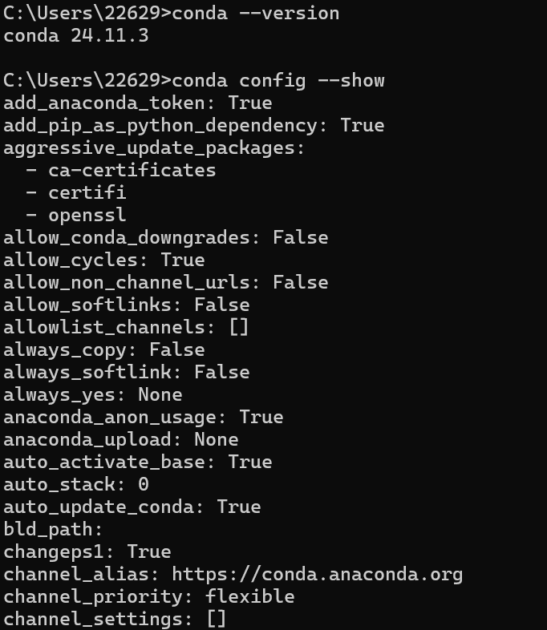
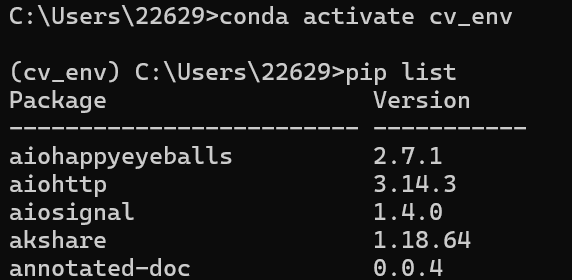
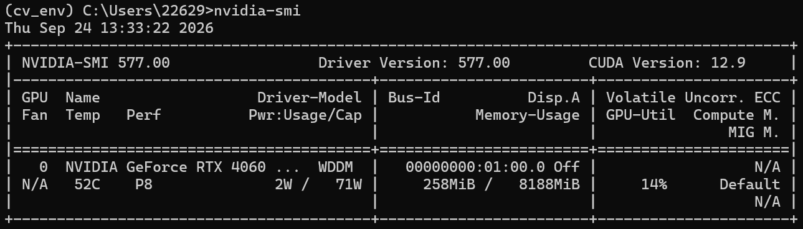
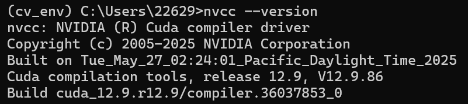
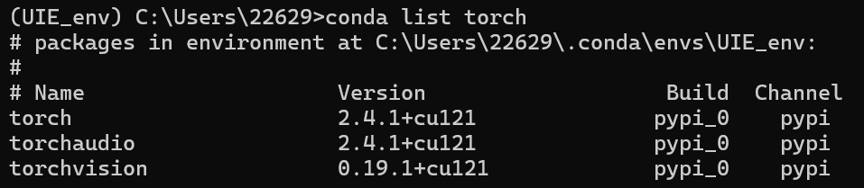
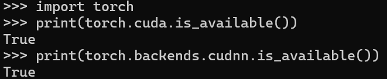

# 实验一：计算机视觉库的安装

## 一、实验目的
掌握 Anaconda 的安装与基本操作，熟悉 GPU 使用环境的配置及对应版本 PyTorch 的安装，并完成 OpenCV 的安装与配置。

## 二、实验内容
### 1、Anaconda的安装及配置

### 2、conda的基本操作与OpenCV的安装
- `conda create -n [env_name] python=[version]` 创建虚拟环境并指定python版本。
- `conda activate cv_env` 进入创建的虚拟环境，使用 `pip install opencv-python` 安装opencv。

### 3、GPU加速环境配置
- `nvidia-smi` 显示显卡状态信息

- 在NVIDIA官网下载对应版本的CUDA Toolkit及cuDNN并安装

### 4、PyTorch安装

### 5、PyTorch GPU加速环境验证

## 三、实验总结
1. 此次实验较为基础，主要为后续CV实验搭建实验环境。
2. 熟悉了Anaconda虚拟环境管理的基本操作。
3. 结合CUDA与cuDNN配置了GPU加速环境，为深层网络的高效训练奠定了基础。
