# 实验⼆：图像增强参考⽂档
## ⼀、实验⽬的 
学会OpenCV的基本使⽤⽅法，利⽤OpenCV等计算机库对图像进⾏平滑、滤波等操作，实现图像增强。 
## ⼆、实验内容 
### 2.1 导⼊图像滤波相关的依赖包 
1. OpenCV库：计算机视觉与图像处理 
2. scikit-image库：图像增强与分析，random_noise ⽤于给图像添加噪声 
3. NumPy库：科学计算的基础库 
4. Matplotlib库：绘图与数据可视化
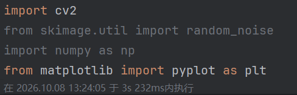
### 2.2 读取原始图像并进⾏⾊彩空间转换 
读取计算机本地图像⽂件，获取并输⼊【100，100】处像素点的RBG参数并输出,通过下⾯的输出结果可以看到【100,100】像素点的RGB为【121,108,200】，表现为偏蓝⾊，通过图像也可以看到这个像素点属于lena的头发的深蓝⾊部位。
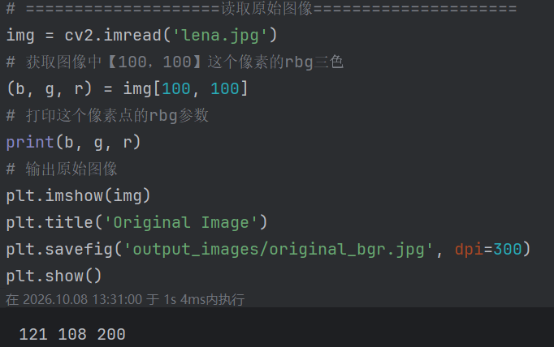
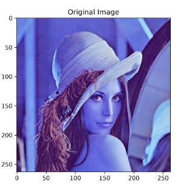
然后测试⼀下cv2中颜⾊空间变换的效果，这⾥的cv2.cvtColor就是颜⾊空间转换，cv2.COLOR_BGR2RGB代表的是将原始图像BGR格式转换成RGB格式，蓝⾊和红⾊互换，因为把'B'和'R'通道互换了，所以这是⼀个红蓝的颜⾊反转。
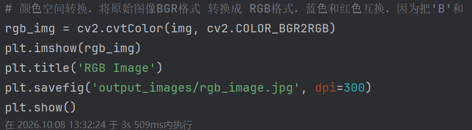
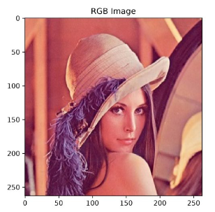
cv2.COLOR_BGR2GRAY是将原始图像的RBG格式转换为灰度图，将三维的RGB通道映射为⼀维的灰度通道
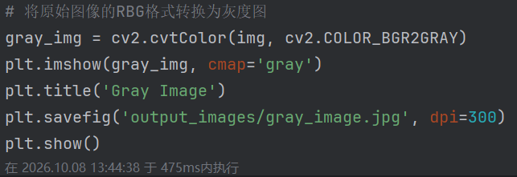
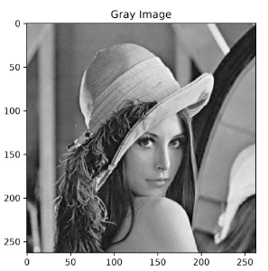

### 2.3 添加噪声 
在RGB原图上添加40%污染比例的椒盐噪声。
添加均值0.2、方差0.03的高斯噪声。
子图同时展示原图、椒盐噪声图、高斯噪声图，保存图片。
1.椒盐噪声（S&P Noise）：随机将部分像素置为纯黑或者纯白，属于突变型噪声，噪点表现为离散的黑白斑点。参数amount控制被噪声污染的像素比例。
2.高斯噪声：给图像每一个像素叠加服从高斯正态分布的随机偏移，噪声均匀分布在整张图像，属于连续型噪声，图像整体出现颗粒感。mean为均值，var为方差，方差越大噪声越强。
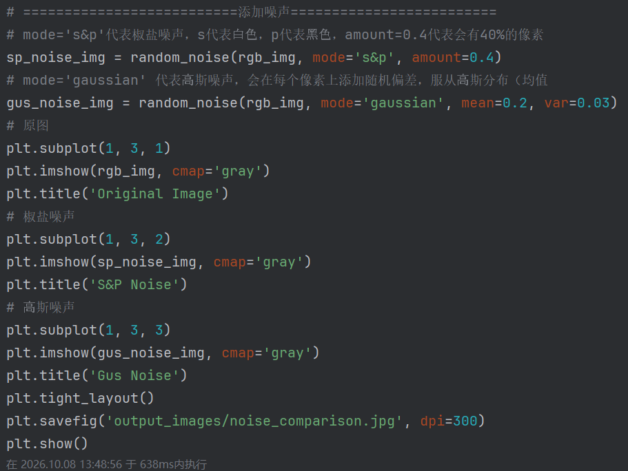
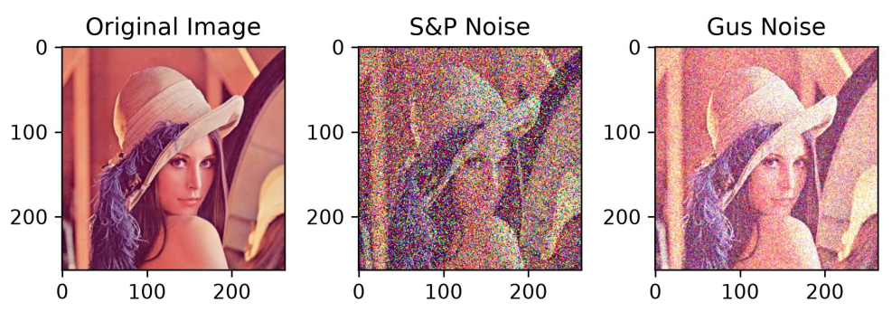

### 2.4 OpenCV 自带滤波处理 
使用 5×5 核大小的均值、中值、高斯滤波，分别处理椒盐噪声图、高斯噪声图。2 行 3 列子图展示全部 6 组滤波结果，保存实验结果。
1.均值滤波：滑动窗口内所有像素取平均值，替换中心像素。可以平滑图像，但会模糊边缘细节。适合处理高斯噪声，对椒盐噪声效果差。cv2.blur()实现。
2.中值滤波：滑动窗口内所有像素排序，取中值替换中心像素。可以消除孤立突变噪点，很好保留边缘，对椒盐噪声效果最优。cv2.medianBlur()实现，输入要求uint8类型。
3.高斯滤波：窗口内像素按照高斯分布加权平均，距离中心越远权重越低。平滑效果自然，适合处理高斯噪声。cv2.GaussianBlur()实现。
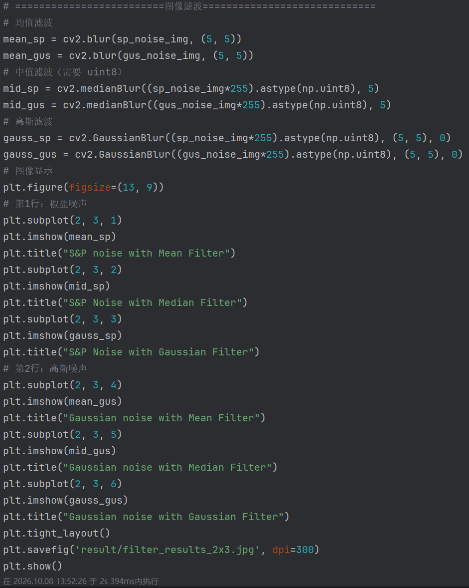
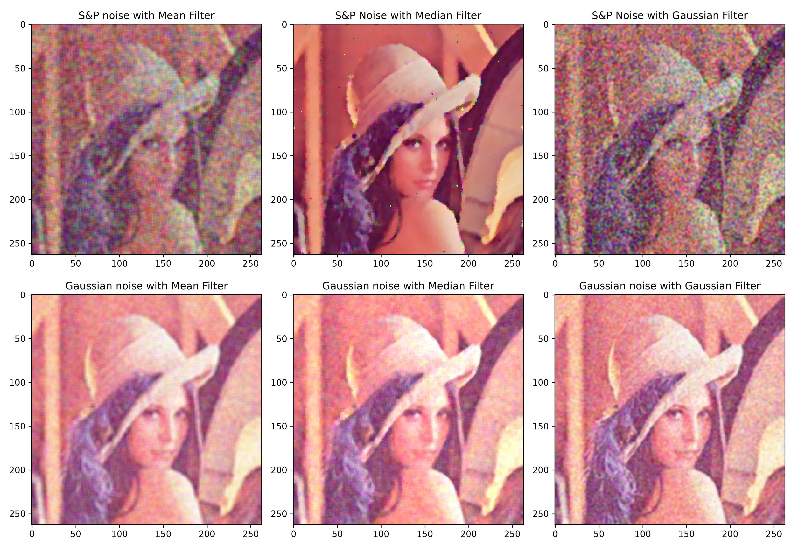

### 2.5 ⼿动实现⼀个滤波⽅式（中值滤波）
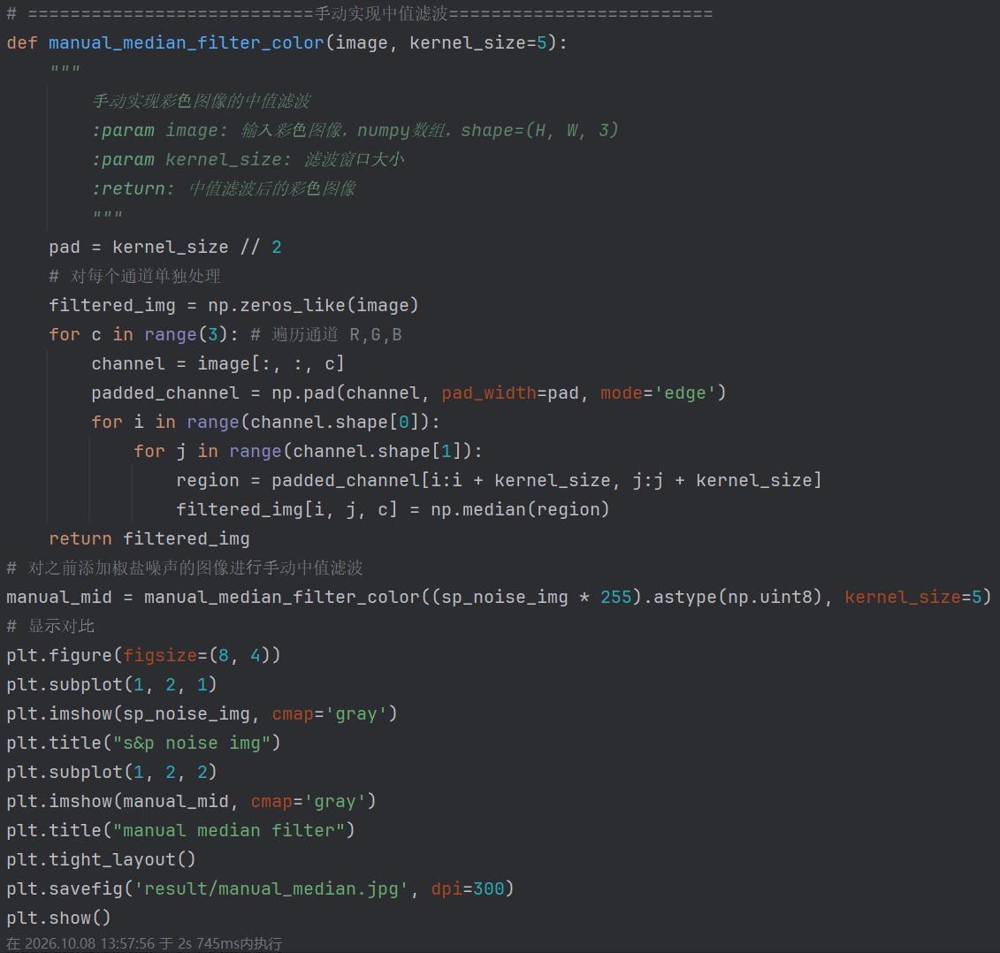
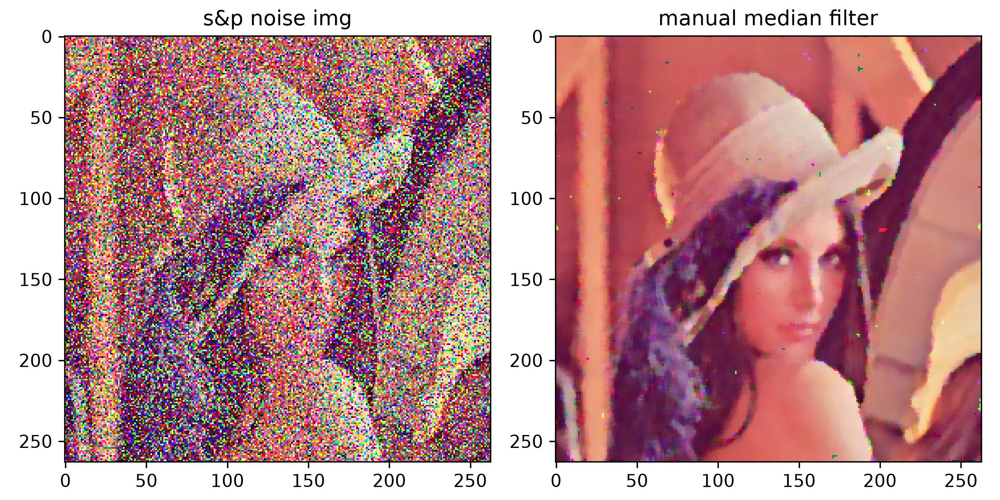

### 2.6 ⼿动实现⼀个滤波⽅式（均值滤波）
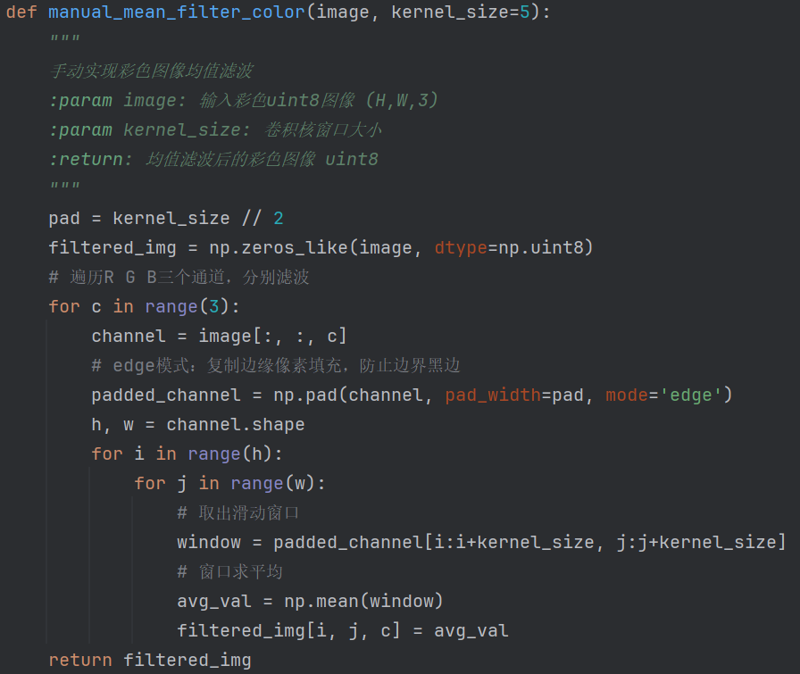
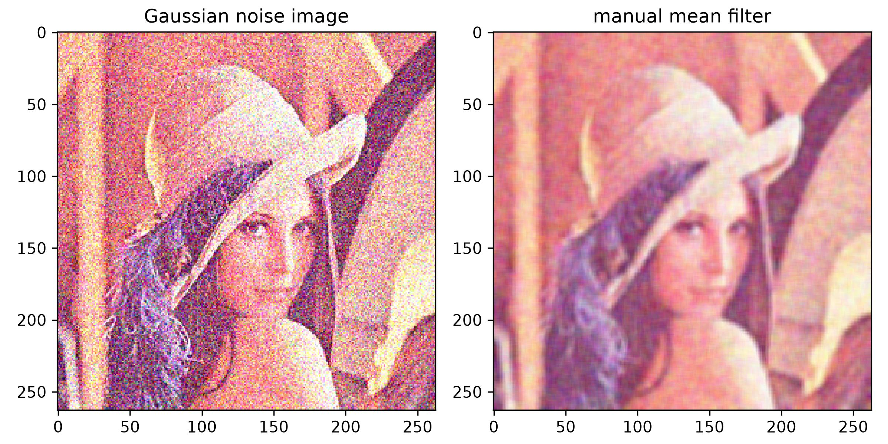
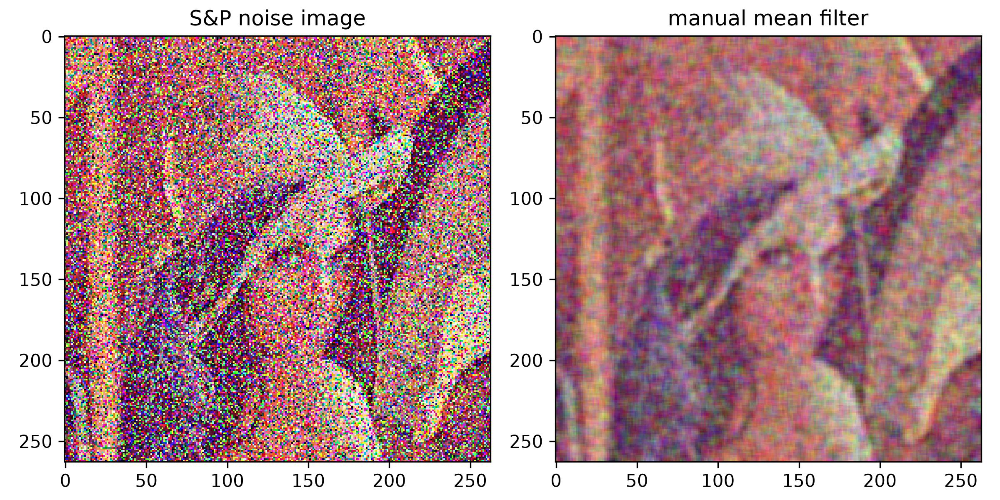

## 三、实验结果与分析
1. 像素读取与色彩转换
直接显示OpenCV读取的是BGR图像，红蓝通道颠倒，颜色失真；经COLOR_BGR2RGB转换后，图像颜色恢复正常。
灰度图去除彩色信息，只保留明暗亮度。
2. 噪声效果
椒盐噪声：画面随机分布大量黑白噪点，局部像素突变破坏画面。
高斯噪声：整张图像布满细密颗粒噪点，没有明显孤立黑点白点，整体亮度发生抖动。
3. 滤波对比
噪声	中值滤波	均值滤波	高斯滤波
椒盐噪声	几乎完全消除噪点，边缘保留完好	噪点无法完全消除，图像边缘模糊	噪点抑制有限，残留颗粒
高斯噪声	降噪效果一般	有效平滑噪声，轻微模糊	降噪效果最好，画面平滑自然

## 四、实验小结
本次实验完成图像读取、色彩空间转换、添加噪声、多种滤波去噪，并且手动复现彩色中值滤波。
实验得出结论：
1.处理椒盐噪声优先选择中值滤波，能够去除孤立黑白噪点同时保留图像轮廓边缘。
2.高斯噪声适合高斯滤波或者均值滤波，可以得到更加平滑自然的图像。
3.彩色图像处理不能直接把三通道当作整体运算，需要对 R、G、B 各个通道分别处理。
4.滤波核大小会影响效果，核越大平滑越强，但是细节丢失越严重。
